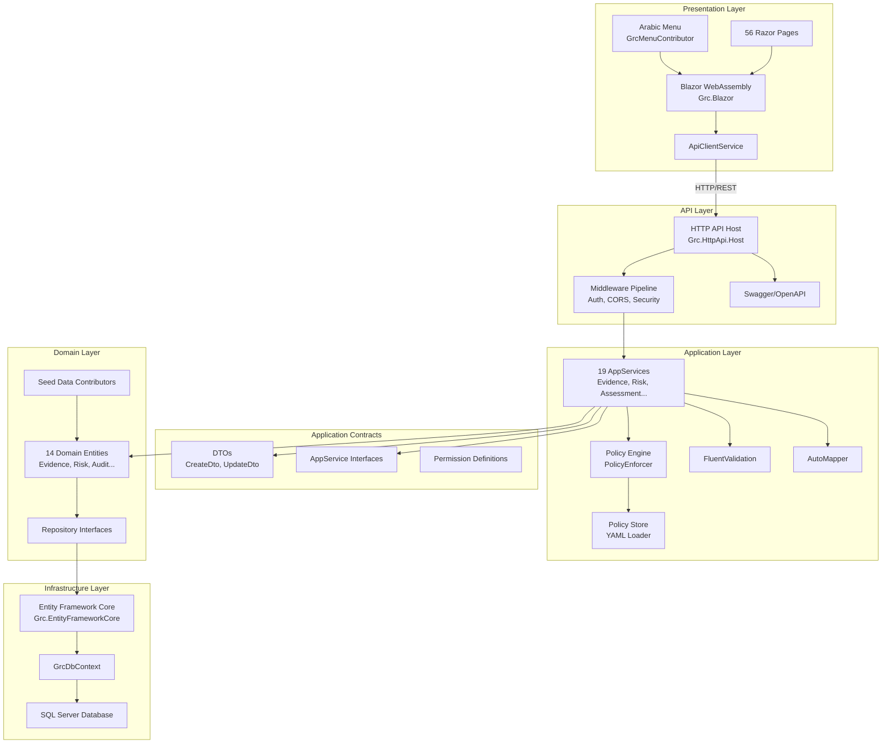
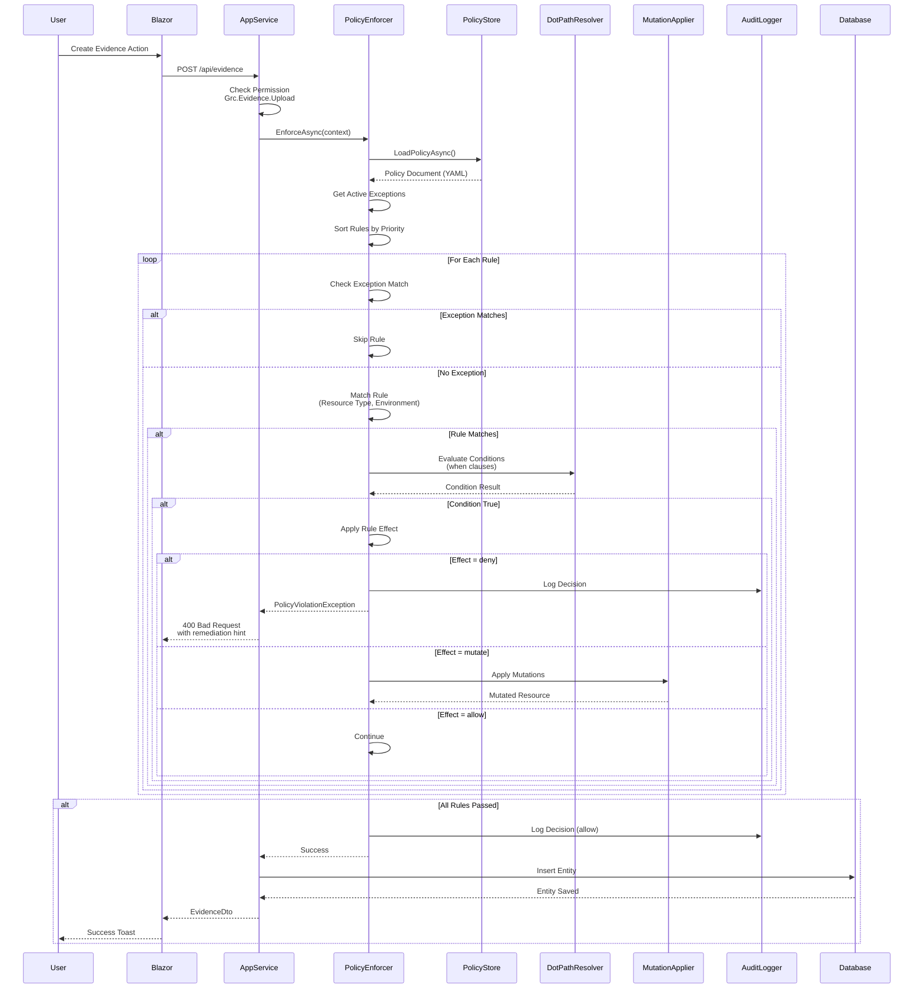
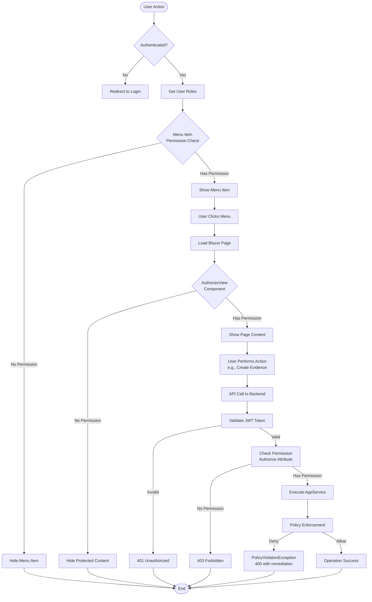
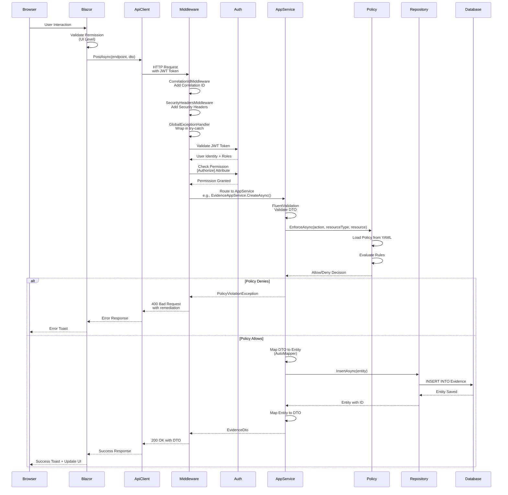
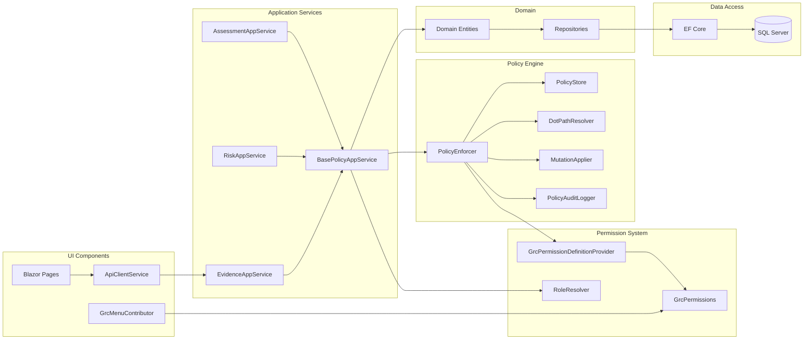
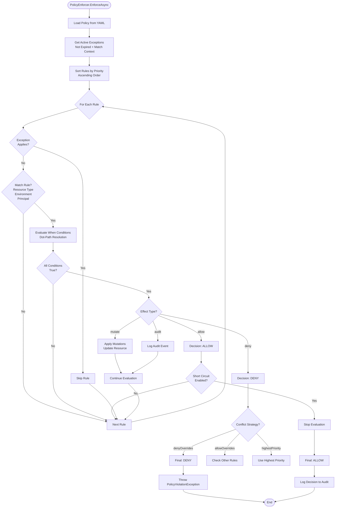

# GRC System - Architecture Documentation

## Overview

The GRC (Governance, Risk, Compliance) System is built on ABP Framework 8.3.0 with .NET 8.0, using Blazor WebAssembly for the frontend and ASP.NET Core for the backend API.

## Visual Architecture Diagrams

### 1. System Layered Architecture



### 2. Policy Enforcement Flow



### 3. Authorization and Permission Flow



### 4. Request Processing Flow (End-to-End)



### 5. Component Interaction Diagram



### 6. Policy Rule Evaluation Logic



### 7. Data Flow: Evidence Creation Example

```mermaid
flowchart LR
    subgraph input["Input"]
        UserInput[User Fills Form<br/>CreateEvidenceDto]
    end
    
    subgraph validation["Validation"]
        FluentVal[FluentValidation<br/>Validate DTO]
        PolicyVal[Policy Enforcement<br/>Check Rules]
    end
    
    subgraph transformation["Transformation"]
        AutoMap[AutoMapper<br/>DTO → Entity]
        Mutation[Apply Mutations<br/>if needed]
    end
    
    subgraph persistence["Persistence"]
        Repo[Repository<br/>InsertAsync]
        EF[EF Core<br/>SaveChanges]
        DB[(Database)]
    end
    
    subgraph output["Output"]
        EntityMap[AutoMapper<br/>Entity → DTO]
        Response[Return EvidenceDto]
    end
    
    UserInput --> FluentVal
    FluentVal --> PolicyVal
    PolicyVal --> AutoMap
    AutoMap --> Mutation
    Mutation --> Repo
    Repo --> EF
    EF --> DB
    DB --> EntityMap
    EntityMap --> Response
```



## System Architecture

```
┌─────────────────────────────────────────────────────────────┐
│                        Client Layer                          │
│  ┌──────────────────────────────────────────────────────┐  │
│  │         Blazor WebAssembly (Grc.Blazor)               │  │
│  │  - Razor Pages (56 pages)                              │  │
│  │  - ApiClientService (HTTP communication)               │  │
│  │  - ErrorToastService (User notifications)              │  │
│  │  - Arabic Menu (GrcMenuContributor)                    │  │
│  └──────────────────────────────────────────────────────┘  │
└─────────────────────────────────────────────────────────────┘
                            │
                            │ HTTP/REST
                            ▼
┌─────────────────────────────────────────────────────────────┐
│                      API Layer                                │
│  ┌──────────────────────────────────────────────────────┐  │
│  │      HTTP API Host (Grc.HttpApi.Host)                 │  │
│  │  - Swagger/OpenAPI                                    │  │
│  │  - JWT Authentication                                 │  │
│  │  - CORS Configuration                                 │  │
│  │  - Health Checks (/health, /health/ready, /health/live)│  │
│  │  - Global Exception Handler                           │  │
│  │  - Correlation ID Middleware                          │  │
│  │  - Security Headers Middleware                         │  │
│  └──────────────────────────────────────────────────────┘  │
└─────────────────────────────────────────────────────────────┘
                            │
                            │ Dependency Injection
                            ▼
┌─────────────────────────────────────────────────────────────┐
│                   Application Layer                          │
│  ┌──────────────────────────────────────────────────────┐  │
│  │      Application Services (Grc.Application)          │  │
│  │  - 19 AppServices (CRUD operations)                   │  │
│  │  - Policy Engine (PolicyEnforcer)                     │  │
│  │  - Policy Store (YAML loader)                        │  │
│  │  - FluentValidation validators                        │  │
│  │  - AutoMapper profiles                                │  │
│  └──────────────────────────────────────────────────────┘  │
│  ┌──────────────────────────────────────────────────────┐  │
│  │      Application Contracts (Grc.Application.Contracts)│ │
│  │  - DTOs (CreateDto, UpdateDto, ListDto)               │  │
│  │  - AppService interfaces                              │  │
│  │  - Permission definitions                             │  │
│  └──────────────────────────────────────────────────────┘  │
└─────────────────────────────────────────────────────────────┘
                            │
                            │ Repository Pattern
                            ▼
┌─────────────────────────────────────────────────────────────┐
│                     Domain Layer                             │
│  ┌──────────────────────────────────────────────────────┐  │
│  │      Domain Entities (Grc.Domain)                     │  │
│  │  - 14 Domain Entities                                 │  │
│  │  - IGovernedResource interface                        │  │
│  │  - Repository interfaces                              │  │
│  │  - Seed data contributors                             │  │
│  └──────────────────────────────────────────────────────┘  │
│  ┌──────────────────────────────────────────────────────┐  │
│  │      Domain Shared (Grc.Domain.Shared)                │  │
│  │  - Permissions (GrcPermissions)                       │  │
│  │  - Role definitions                                   │  │
│  │  - Localization                                       │  │
│  └──────────────────────────────────────────────────────┘  │
└─────────────────────────────────────────────────────────────┘
                            │
                            │ Entity Framework Core
                            ▼
┌─────────────────────────────────────────────────────────────┐
│                  Infrastructure Layer                        │
│  ┌──────────────────────────────────────────────────────┐  │
│  │      EntityFrameworkCore (Grc.EntityFrameworkCore)    │  │
│  │  - GrcDbContext                                       │  │
│  │  - Entity configurations                              │  │
│  │  - Migrations                                         │  │
│  └──────────────────────────────────────────────────────┘  │
│  ┌──────────────────────────────────────────────────────┐  │
│  │      Database (SQL Server)                            │  │
│  │  - GrcDb database                                     │  │
│  │  - Identity tables (ABP)                              │  │
│  │  - GRC entity tables                                  │  │
│  └──────────────────────────────────────────────────────┘  │
└─────────────────────────────────────────────────────────────┘
```

## Component Details

### 1. Blazor WebAssembly Frontend

**Project:** `Grc.Blazor`

**Technologies:**
- Blazor WebAssembly 8.0
- ABP Framework Blazor components
- Bootstrap (via ABP theme)

**Key Components:**
- **ApiClientService:** HTTP client wrapper with error handling
- **ErrorToastService:** Toast notifications for errors/success
- **GrcMenuContributor:** Arabic menu with permission-based visibility
- **56 Razor Pages:** Complete UI for all GRC modules

**Communication:**
- Calls backend API via `ApiClientService`
- Base URL: `/api/`
- Handles JWT authentication
- Displays policy violations with remediation hints

### 2. HTTP API Host

**Project:** `Grc.HttpApi.Host`

**Technologies:**
- ASP.NET Core 8.0
- ABP Framework 8.3.0
- Swagger/OpenAPI
- Serilog for logging
- Application Insights (optional)

**Middleware Pipeline:**
1. CorrelationIdMiddleware - Request tracking
2. SecurityHeadersMiddleware - Security headers
3. GlobalExceptionHandlerMiddleware - Error handling
4. CORS
5. Authentication (JWT)
6. Authorization
7. Health Checks
8. Controllers

**Endpoints:**
- `/health` - Overall health
- `/health/ready` - Readiness (database, policy store)
- `/health/live` - Liveness (self check)
- `/swagger` - API documentation (Development)
- `/api/*` - Application endpoints

### 3. Application Layer

**Project:** `Grc.Application`

**Responsibilities:**
- Business logic
- Policy enforcement
- Data transformation (AutoMapper)
- Input validation (FluentValidation)

**Key Services:**
- **19 AppServices:** One per entity (Evidence, Risk, Assessment, etc.)
- **PolicyEnforcer:** Deterministic policy evaluation
- **PolicyStore:** YAML policy loading and caching
- **DotPathResolver:** Dot-path value resolution
- **MutationApplier:** Resource mutations

**Policy Integration:**
All AppServices inherit from `BasePolicyAppService` which provides:
- `EnforceAsync()` method
- Automatic policy evaluation
- Policy violation exceptions

### 4. Domain Layer

**Projects:** `Grc.Domain`, `Grc.Domain.Shared`

**Entities:**
- Evidence
- Assessment
- Risk
- Audit
- ActionPlan
- PolicyDocument
- RegulatoryFramework
- Regulator
- Vendor
- ComplianceEvent
- ControlAssessment
- Workflow
- Notification
- Subscription

**Interfaces:**
- `IGovernedResource`: Metadata interface for policy evaluation

**Seed Data:**
- `GrcRoleDataSeedContributor`: Creates 11 predefined roles
- `GrcAdminUserDataSeedContributor`: Creates admin user

### 5. Policy Engine

**Location:** `Grc.Application/Policy/`

**Components:**

1. **PolicyContext:** Evaluation context
   - Action (create/update/submit/approve)
   - Environment (dev/staging/prod)
   - ResourceType
   - Resource (entity/DTO)
   - Principal (user/roles)

2. **PolicyEnforcer:** Main evaluation engine
   - Loads policy from YAML
   - Evaluates rules by priority
   - Handles exceptions
   - Applies mutations
   - Returns decision

3. **PolicyStore:** Policy loading
   - Loads from `etc/policies/`
   - Caches policy in memory
   - Supports hot reload

4. **DotPathResolver:** Value resolution
   - Resolves dot-paths (e.g., `metadata.labels.dataClassification`)
   - Supports nested objects
   - Handles null values

5. **MutationApplier:** Resource mutations
   - Applies mutations from rules
   - Supports set/remove/add operations
   - Deterministic application

**Policy File:** `etc/policies/grc-baseline.yml`

**Rules:**
- REQUIRE_DATA_CLASSIFICATION
- REQUIRE_OWNER
- PROD_RESTRICTED_MUST_HAVE_APPROVAL
- NORMALIZE_EMPTY_LABELS

### 6. Database

**Technology:** SQL Server 2022

**Tables:**
- ABP Identity tables (Users, Roles, Permissions)
- ABP Tenant Management tables
- GRC entity tables (14 entities)
- Audit log tables (ABP)

**Migrations:**
- Managed via Entity Framework Core
- Run via `Grc.DbMigrator` project
- Initial migration: `20260102091922_Initial.cs`

## Data Flow

### Create Evidence Flow

```
1. User fills form in Blazor
   ↓
2. Blazor calls ApiClientService.PostAsync("/api/evidence", dto)
   ↓
3. API Host receives request
   ↓
4. GlobalExceptionHandlerMiddleware catches errors
   ↓
5. CorrelationIdMiddleware adds correlation ID
   ↓
6. SecurityHeadersMiddleware adds security headers
   ↓
7. JWT Authentication validates token
   ↓
8. Authorization checks GrcPermissions.Evidence.Upload
   ↓
9. EvidenceAppService.CreateAsync() called
   ↓
10. FluentValidation validates DTO
   ↓
11. PolicyEnforcer.EnforceAsync() evaluates policies
    - Checks data classification
    - Checks owner
    - Applies mutations if needed
   ↓
12. Entity mapped from DTO (AutoMapper)
   ↓
13. Repository.InsertAsync() saves to database
   ↓
14. DTO returned to client
   ↓
15. Blazor displays success toast
```

### Policy Evaluation Flow

```
1. PolicyEnforcer.EnforceAsync(context)
   ↓
2. PolicyStore.LoadPolicyAsync() - loads YAML
   ↓
3. Check exceptions (match context + not expired)
   ↓
4. Sort rules by priority (ascending)
   ↓
5. For each rule:
   a. Check match conditions (resource type, environment)
   b. Evaluate "when" conditions (dot-path checks)
   c. If match:
      - If effect = "deny" → throw PolicyViolationException
      - If effect = "mutate" → apply mutations
      - If effect = "allow" → continue
      - If effect = "audit" → log and continue
   ↓
6. If no deny → allow
   ↓
7. Log decision (PolicyAuditLogger)
```

## Security Architecture

### Authentication
- **Method:** JWT Bearer tokens
- **Issuer:** GrcSystem
- **Audience:** GrcSystem
- **Expiration:** 3600 seconds (configurable)

### Authorization
- **Method:** ABP Permission system
- **Granularity:** Per-module, per-action
- **Examples:**
  - `Grc.Evidence.View` - View evidence
  - `Grc.Evidence.Upload` - Upload evidence
  - `Grc.Evidence.Approve` - Approve evidence

### Policy Enforcement
- **Location:** Backend only (no UI-only checks)
- **Timing:** Before database operations
- **Deterministic:** Same input = same decision

### Security Headers
- X-Content-Type-Options: nosniff
- X-Frame-Options: DENY
- X-XSS-Protection: 1; mode=block
- Content-Security-Policy: (configured)
- Referrer-Policy: strict-origin-when-cross-origin

## Multi-Tenancy

**Enabled:** Yes

**Mode:** Hybrid (shared database, separate schemas)

**Tenant Resolution:**
- From JWT token
- From subdomain
- From header

**Data Isolation:**
- All entities include TenantId
- Queries automatically filtered by tenant
- Cross-tenant access prevented

## Error Handling

### Global Exception Handler

**Location:** `GlobalExceptionHandlerMiddleware`

**Handles:**
- `BusinessException` → 400 Bad Request
- `PolicyViolationException` → 400 with remediation hint
- `UnauthorizedAccessException` → 401 Unauthorized
- `KeyNotFoundException` → 404 Not Found
- Generic exceptions → 500 Internal Server Error

**Response Format:**
```json
{
  "code": "Grc:PolicyViolation",
  "message": "Missing/invalid metadata.labels.dataClassification",
  "correlationId": "guid",
  "remediationHint": "Set metadata.labels.dataClassification to one of the allowed values.",
  "validationErrors": ["error1", "error2"]
}
```

## Logging

### Serilog Configuration

**Sinks:**
- Console (development)
- File (logs/grc-YYYYMMDD.txt)
- Application Insights (production, if configured)

**Enrichment:**
- Machine name
- Thread ID
- Correlation ID
- User ID (from ABP)

**Log Levels:**
- Development: Debug
- Production: Warning

## Monitoring

### Health Checks

**Endpoints:**
- `/health` - Overall health
- `/health/ready` - Readiness (database, policy store)
- `/health/live` - Liveness (self)

**Checks:**
- Database connectivity
- Policy store accessibility
- Self check

### Application Insights

**Features:**
- Request telemetry
- Dependency tracking
- Exception tracking
- Performance counters
- Custom metrics

## Deployment Architecture

### Development
- Local SQL Server
- API Host: localhost:5000
- Blazor: localhost:8080
- No containerization

### Staging/Production
- Docker containers
- Docker Compose orchestration
- SQL Server in container
- API Host in container
- Blazor served via nginx

## Scalability Considerations

### Horizontal Scaling
- Stateless API (can scale horizontally)
- Database connection pooling
- Caching (future: Redis)

### Performance
- Async/await throughout
- Database indexes on foreign keys
- Policy caching in memory
- Connection pooling

## Technology Stack

### Backend
- .NET 8.0
- ABP Framework 8.3.0
- Entity Framework Core 8.0
- SQL Server 2022
- Serilog
- FluentValidation
- AutoMapper
- YamlDotNet

### Frontend
- Blazor WebAssembly 8.0
- ABP Blazor components
- Bootstrap (via ABP theme)

### Infrastructure
- Docker
- Docker Compose
- GitHub Actions (CI/CD)
- Application Insights (monitoring)

## Design Patterns

1. **Repository Pattern:** Data access abstraction
2. **Unit of Work:** Transaction management (ABP)
3. **Dependency Injection:** Service registration (ABP Autofac)
4. **Policy Pattern:** Policy engine for business rules
5. **Strategy Pattern:** Conflict resolution strategies
6. **Middleware Pattern:** Request pipeline processing

## Future Enhancements

1. **Caching:** Redis for distributed caching
2. **Message Queue:** RabbitMQ/Azure Service Bus for async processing
3. **Search:** Elasticsearch for full-text search
4. **File Storage:** Azure Blob Storage / AWS S3
5. **Real-time:** SignalR for real-time updates

---

**Last Updated:** 2026-01-02
