# GRC System - Architecture Diagram Book

Complete visual documentation of the GRC system architecture, design patterns, and data flows.

---

## Table of Contents

1. [System Layered Architecture](#1-system-layered-architecture)
2. [Policy Enforcement Flow](#2-policy-enforcement-flow)
3. [Authorization and Permission Flow](#3-authorization-and-permission-flow)
4. [Request Processing Flow](#4-request-processing-flow)
5. [Component Interaction Diagram](#5-component-interaction-diagram)
6. [Policy Rule Evaluation Logic](#6-policy-rule-evaluation-logic)
7. [Data Flow: Evidence Creation Example](#7-data-flow-evidence-creation-example)

---

## 1. System Layered Architecture

Shows the complete layered architecture from Blazor UI through API layer, Application layer, Domain layer, to Infrastructure layer following ABP Framework patterns.


### Key Components

**Presentation Layer:**
- Blazor WebAssembly application
- Arabic menu with permission-based visibility
- 56 Razor pages for all GRC modules
- ApiClientService for HTTP communication

**API Layer:**
- HTTP API Host with middleware pipeline
- Authentication, CORS, Security Headers
- Swagger/OpenAPI documentation

**Application Layer:**
- 19 AppServices for business logic
- Policy Engine for rule enforcement
- FluentValidation for input validation
- AutoMapper for DTO mapping

**Domain Layer:**
- 14 Domain Entities
- Repository interfaces
- Seed data contributors

**Infrastructure Layer:**
- Entity Framework Core
- SQL Server database

---

## 2. Policy Enforcement Flow

Detailed sequence diagram showing how policy evaluation works from user action through policy enforcement to final decision.


### Key Steps

1. **User Action**: User performs action in Blazor UI
2. **Permission Check**: AppService verifies user has required permission
3. **Policy Enforcement**: PolicyEnforcer.EnforceAsync() called
4. **Policy Loading**: Policy loaded from YAML file via PolicyStore
5. **Exception Check**: Active exceptions evaluated first
6. **Rule Evaluation**: Rules sorted by priority and evaluated sequentially
7. **Condition Evaluation**: Dot-path conditions checked via DotPathResolver
8. **Effect Application**: 
   - **deny**: Throws PolicyViolationException
   - **mutate**: Applies mutations via MutationApplier
   - **allow**: Continues evaluation
   - **audit**: Logs and continues
9. **Decision Logging**: All decisions logged via AuditLogger
10. **Database Operation**: If allowed, entity saved to database

---

## 3. Authorization and Permission Flow

Complete authorization flow from user action through menu visibility, page access, API permission checks, and policy enforcement.


### Security Layers

**Layer 1: Authentication**
- JWT Token Validation on every API request
- OpenIddict authentication provider
- User identity and roles extracted

**Layer 2: Menu Permission Check**
- Location: `GrcMenuContributor.cs`
- Check: `RequiredPermissionName` attribute
- Result: Menu items hidden if user lacks permission

**Layer 3: Page Component Authorization**
- Location: Blazor Razor pages
- Check: `AuthorizeView` component
- Result: Protected content hidden if no permission

**Layer 4: API Permission Check**
- Location: AppService methods
- Check: `[Authorize(PermissionName)]` attribute
- Result: 403 Forbidden if no permission

**Layer 5: Policy Enforcement**
- Location: `BasePolicyAppService.EnforceAsync()`
- Check: Business rules from YAML policy
- Result: PolicyViolationException with remediation hint

---

## 4. Request Processing Flow

Complete request lifecycle from browser interaction through all middleware layers, authentication, authorization, business logic, and database persistence.

```mermaid
sequenceDiagram
    participant Browser
    participant Blazor
    participant ApiClient
    participant Middleware
    participant Auth
    participant AppService
    participant Policy
    participant Repository
    participant Database
    
    Browser->>Blazor: User Interaction
    Blazor->>Blazor: Validate Permission<br/>(UI Level)
    Blazor->>ApiClient: PostAsync(endpoint, dto)
    
    ApiClient->>Middleware: HTTP Request<br/>with JWT Token
    
    Middleware->>Middleware: CorrelationIdMiddleware<br/>Add Correlation ID
    Middleware->>Middleware: SecurityHeadersMiddleware<br/>Add Security Headers
    Middleware->>Middleware: GlobalExceptionHandler<br/>Wrap in try-catch
    
    Middleware->>Auth: Validate JWT Token
    Auth-->>Middleware: User Identity + Roles
    
    Middleware->>Auth: Check Permission<br/>[Authorize] Attribute
    Auth-->>Middleware: Permission Granted
    
    Middleware->>AppService: Route to AppService<br/>e.g., EvidenceAppService.CreateAsync()
    
    AppService->>AppService: FluentValidation<br/>Validate DTO
    
    AppService->>Policy: EnforceAsync(action, resourceType, resource)
    Policy->>Policy: Load Policy from YAML
    Policy->>Policy: Evaluate Rules
    Policy-->>AppService: Allow/Deny Decision
    
    alt Policy Denies
        AppService-->>Middleware: PolicyViolationException
        Middleware-->>ApiClient: 400 Bad Request<br/>with remediation
        ApiClient-->>Blazor: Error Response
        Blazor-->>Browser: Error Toast
    else Policy Allows
        AppService->>AppService: Map DTO to Entity<br/>(AutoMapper)
        AppService->>Repository: InsertAsync(entity)
        Repository->>Database: INSERT INTO Evidence
        Database-->>Repository: Entity Saved
        Repository-->>AppService: Entity with ID
        AppService->>AppService: Map Entity to DTO
        AppService-->>Middleware: EvidenceDto
        Middleware-->>ApiClient: 200 OK with DTO
        ApiClient-->>Blazor: Success Response
        Blazor-->>Browser: Success Toast + Update UI
    end
```



### Request Pipeline Stages

**Stage 1: Client Side (Blazor)**
- User interaction triggers action
- UI-level permission check (optional, for UX)
- ApiClientService prepares HTTP request with JWT token

**Stage 2: Middleware Pipeline**
1. CorrelationIdMiddleware: Adds unique correlation ID
2. SecurityHeadersMiddleware: Adds security headers
3. GlobalExceptionHandler: Wraps request in try-catch
4. CORS: Handles cross-origin requests
5. Authentication: Validates JWT token
6. Multi-Tenancy: Resolves tenant context
7. Authorization: Checks permissions

**Stage 3: Application Service**
1. FluentValidation: Validates DTO input
2. Policy Enforcement: Evaluates business rules
3. AutoMapper: Maps DTO to Entity
4. Business Logic: Applies domain rules

**Stage 4: Data Access**
1. Repository Pattern: Abstracts data access
2. Entity Framework Core: Generates SQL
3. Database: Executes SQL and returns result

**Stage 5: Response**
1. AutoMapper: Maps Entity to DTO
2. Middleware: Adds headers, handles errors
3. Client: Receives response and updates UI

---

## 5. Component Interaction Diagram

Shows relationships and dependencies between major system components.


### Dependency Flow

1. **UI → Services**: Blazor pages call AppServices via ApiClientService
2. **Services → Policy**: AppServices use BasePolicyAppService which calls PolicyEnforcer
3. **Policy → Store**: PolicyEnforcer loads policies from PolicyStore
4. **Policy → Permissions**: PolicyEnforcer checks permissions via PermProvider
5. **Services → Domain**: AppServices work with Domain Entities
6. **Domain → Data**: Entities accessed via Repositories → EF Core → Database

### Key Patterns

- **Dependency Injection**: All components registered in ABP modules
- **Repository Pattern**: Domain entities accessed through repository interfaces
- **Policy Pattern**: Business rules externalized to YAML files
- **Base Class Pattern**: All AppServices inherit from BasePolicyAppService

---

## 6. Policy Rule Evaluation Logic

Detailed flowchart showing the deterministic policy evaluation algorithm.


### Evaluation Algorithm

**Step 1: Policy Loading**
- Load policy from YAML file via PolicyStore
- Cache policy in memory for performance
- Validate policy structure

**Step 2: Exception Processing**
- Get all exceptions from policy
- Filter active exceptions (not expired)
- Check if exception matches current context
- Exceptions override matching rules

**Step 3: Rule Sorting**
- Sort rules by priority (ascending)
- Lower priority number = evaluated first
- Deterministic order ensures consistent results

**Step 4: Rule Evaluation Loop**
For each rule in priority order:
1. **Exception Check**: If exception applies, skip rule
2. **Match Check**: Evaluate match conditions (resource type, environment, principal)
3. **Condition Evaluation**: If match, evaluate "when" conditions using DotPathResolver
4. **Effect Application**: If all conditions true, apply effect (deny/allow/mutate/audit)

**Step 5: Conflict Resolution**
If multiple rules match with different effects:
- **denyOverrides**: Any deny wins (default)
- **allowOverrides**: Any allow wins
- **highestPriority**: Highest priority rule wins

**Step 6: Short Circuit**
If shortCircuit enabled and terminal decision reached:
- Stop evaluation early
- Return decision immediately

**Step 7: Final Decision**
- If any deny: Throw PolicyViolationException
- If all allow: Continue to database operation
- Log decision to audit log

### Deterministic Properties

1. **Same Input = Same Output**: Identical context always produces same decision
2. **Priority Order**: Rules always evaluated in priority order
3. **Exception Priority**: Exceptions evaluated before rules
4. **No Randomness**: No random or time-based decisions

---

## 7. Data Flow: Evidence Creation Example

Step-by-step data flow for creating evidence, showing validation, transformation, persistence, and output stages.


### Detailed Flow

**Stage 1: Input**
- User fills form with evidence details
- Form data bound to `CreateEvidenceDto`
- DTO contains: Name, Description, Owner, DataClassification

**Stage 2: Validation**
- **FluentValidation**: Validates required fields and formats
- **Policy Enforcement**: Checks data classification, owner, prod approval

**Stage 3: Transformation**
- **AutoMapper**: Maps `CreateEvidenceDto` to `Evidence` entity
- **Mutation Application**: Applies policy mutations if needed

**Stage 4: Persistence**
- **Repository**: `InsertAsync(entity)` called
- **EF Core**: Generates SQL INSERT statement
- **Database**: Stores entity in SQL Server

**Stage 5: Output**
- **AutoMapper**: Maps `Evidence` entity to `EvidenceDto`
- **Response**: Returns DTO as JSON with HTTP 200 OK

### Example Data Transformation

**Input (CreateEvidenceDto):**
```json
{
  "name": "Security Audit Report",
  "description": "Q4 2025 security audit",
  "owner": null,
  "dataClassification": "confidential"
}
```

**After Policy Enforcement:**
- Owner set to current user (mutation applied)
- Data classification validated

**After Database (Entity with ID):**
```csharp
{
  Id: "123e4567-e89b-12d3-a456-426614174000",
  Name: "Security Audit Report",
  Description: "Q4 2025 security audit",
  Owner: "current-user@example.com",
  DataClassification: "confidential",
  Status: "Draft",
  CreationTime: DateTime.UtcNow
}
```

**Output (EvidenceDto):**
```json
{
  "id": "123e4567-e89b-12d3-a456-426614174000",
  "name": "Security Audit Report",
  "description": "Q4 2025 security audit",
  "owner": "current-user@example.com",
  "dataClassification": "confidential",
  "status": "Draft",
  "creationTime": "2026-01-02T10:30:00Z"
}
```

---

## Related Documentation

- **Full Architecture**: `ARCHITECTURE.md` - Complete architecture documentation
- **Diagrams Summary**: `ARCHITECTURE_DIAGRAMS_SUMMARY.md` - Quick reference guide
- **Individual Diagrams**: `diagrams/` - Separate diagram files
- **Developer Guide**: `DEVELOPER_GUIDE.md` - Development instructions
- **Deployment Guide**: `DEPLOYMENT.md` - Deployment instructions

## How to View Diagrams

All diagrams use **Mermaid** syntax and render in:
- **GitHub**: Automatically in markdown files
- **VS Code**: With "Markdown Preview Mermaid Support" extension
- **Online**: Copy code to https://mermaid.live/
- **Documentation Tools**: Most modern tools support Mermaid

---

**Last Updated:** 2026-01-02
