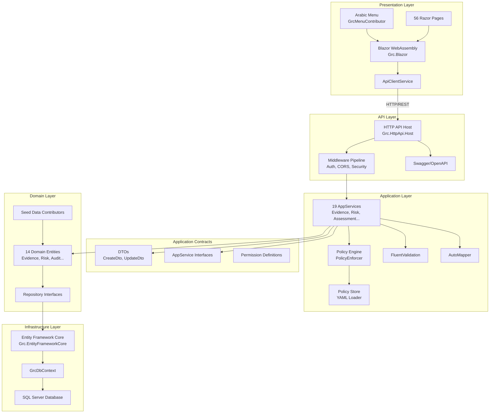

# System Layered Architecture

## Description
Shows the complete layered architecture from Blazor UI through API layer, Application layer, Domain layer, to Infrastructure layer following ABP Framework patterns.

## Diagram

## Key Components

### Presentation Layer
- **Grc.Blazor**: Blazor WebAssembly application
- **GrcMenuContributor**: Arabic menu with permission-based visibility
- **56 Razor Pages**: Complete UI for all GRC modules
- **ApiClientService**: HTTP client wrapper for API communication

### API Layer
- **Grc.HttpApi.Host**: ASP.NET Core API host
- **Middleware Pipeline**: Authentication, CORS, Security Headers, Exception Handling
- **Swagger/OpenAPI**: API documentation

### Application Layer
- **19 AppServices**: Business logic for each entity
- **Policy Engine**: Deterministic policy evaluation
- **Policy Store**: YAML policy loader with caching
- **FluentValidation**: Input validation
- **AutoMapper**: DTO ↔ Entity mapping

### Domain Layer
- **14 Domain Entities**: Core business entities
- **Repository Interfaces**: Data access abstraction
- **Seed Data Contributors**: Initial data setup

### Infrastructure Layer
- **Entity Framework Core**: ORM
- **GrcDbContext**: Database context
- **SQL Server**: Database

## Related Files
- `src/Grc.Blazor/GrcBlazorModule.cs`
- `src/Grc.HttpApi.Host/GrcHttpApiHostModule.cs`
- `src/Grc.Application/GrcApplicationModule.cs`
- `src/Grc.Domain/GrcDomainModule.cs`
- `src/Grc.EntityFrameworkCore/GrcEntityFrameworkCoreModule.cs`
