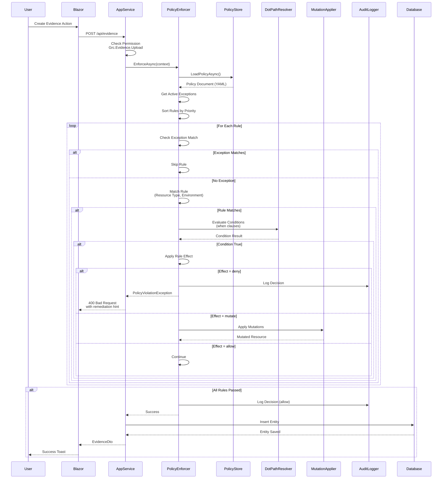

# Policy Enforcement Flow

## Description
Detailed sequence diagram showing how policy evaluation works from user action through policy enforcement to final decision. Demonstrates the deterministic evaluation process.

## Diagram

## Key Steps

1. **User Action**: User performs action in Blazor UI
2. **Permission Check**: AppService verifies user has required permission
3. **Policy Enforcement**: PolicyEnforcer.EnforceAsync() called
4. **Policy Loading**: Policy loaded from YAML file via PolicyStore
5. **Exception Check**: Active exceptions evaluated first
6. **Rule Evaluation**: Rules sorted by priority and evaluated sequentially
7. **Condition Evaluation**: Dot-path conditions checked via DotPathResolver
8. **Effect Application**: 
   - **deny**: Throws PolicyViolationException
   - **mutate**: Applies mutations via MutationApplier
   - **allow**: Continues evaluation
   - **audit**: Logs and continues
9. **Decision Logging**: All decisions logged via AuditLogger
10. **Database Operation**: If allowed, entity saved to database

## Related Files
- `src/Grc.Application/Policy/PolicyEnforcer.cs`
- `src/Grc.Application/Policy/PolicyStore.cs`
- `src/Grc.Application/Policy/DotPathResolver.cs`
- `src/Grc.Application/Policy/MutationApplier.cs`
- `src/Grc.Application/Policy/PolicyAuditLogger.cs`
- `src/Grc.Application/Policy/BasePolicyAppService.cs`
- `etc/policies/grc-baseline.yml`
