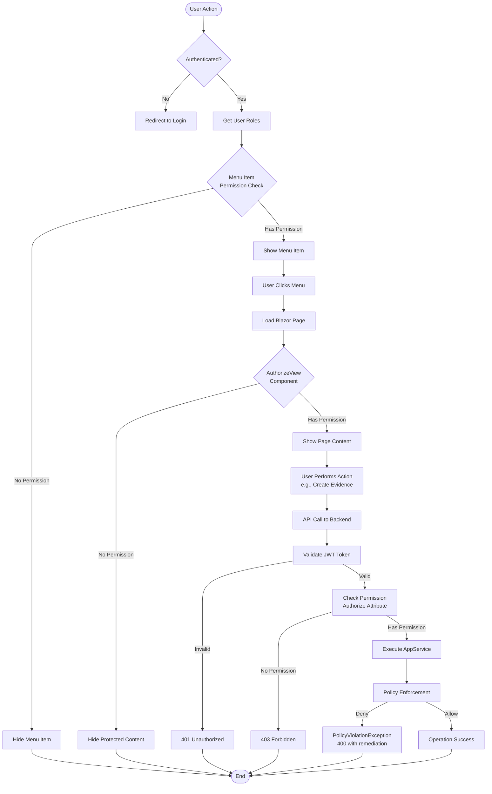

# Authorization and Permission Flow

## Description
Complete authorization flow from user action through menu visibility, page access, API permission checks, and policy enforcement. Shows the two-tier security model (Permissions + Policies).

## Diagram

## Security Layers

### Layer 1: Authentication
- **JWT Token Validation**: Token validated on every API request
- **OpenIddict**: ABP Framework authentication provider
- **Result**: User identity and roles extracted

### Layer 2: Menu Permission Check
- **Location**: `GrcMenuContributor.cs`
- **Check**: `RequiredPermissionName` attribute
- **Result**: Menu items hidden if user lacks permission
- **Example**: `GrcPermissions.Evidence.View`

### Layer 3: Page Component Authorization
- **Location**: Blazor Razor pages
- **Check**: `AuthorizeView` component
- **Result**: Protected content hidden if no permission
- **Example**: Create button only visible with `Grc.Evidence.Upload`

### Layer 4: API Permission Check
- **Location**: AppService methods
- **Check**: `[Authorize(PermissionName)]` attribute
- **Result**: 403 Forbidden if no permission
- **Example**: `[Authorize(GrcPermissions.Evidence.Upload)]`

### Layer 5: Policy Enforcement
- **Location**: `BasePolicyAppService.EnforceAsync()`
- **Check**: Business rules from YAML policy
- **Result**: PolicyViolationException with remediation hint
- **Example**: Data classification required, owner required

## Related Files
- `src/Grc.Blazor/Menus/GrcMenuContributor.cs`
- `src/Grc.Domain.Shared/Permissions/GrcPermissions.cs`
- `src/Grc.Application.Contracts/Permissions/GrcPermissionDefinitionProvider.cs`
- `src/Grc.Application/Policy/BasePolicyAppService.cs`
- `src/Grc.Application/Evidence/EvidenceAppService.cs`
