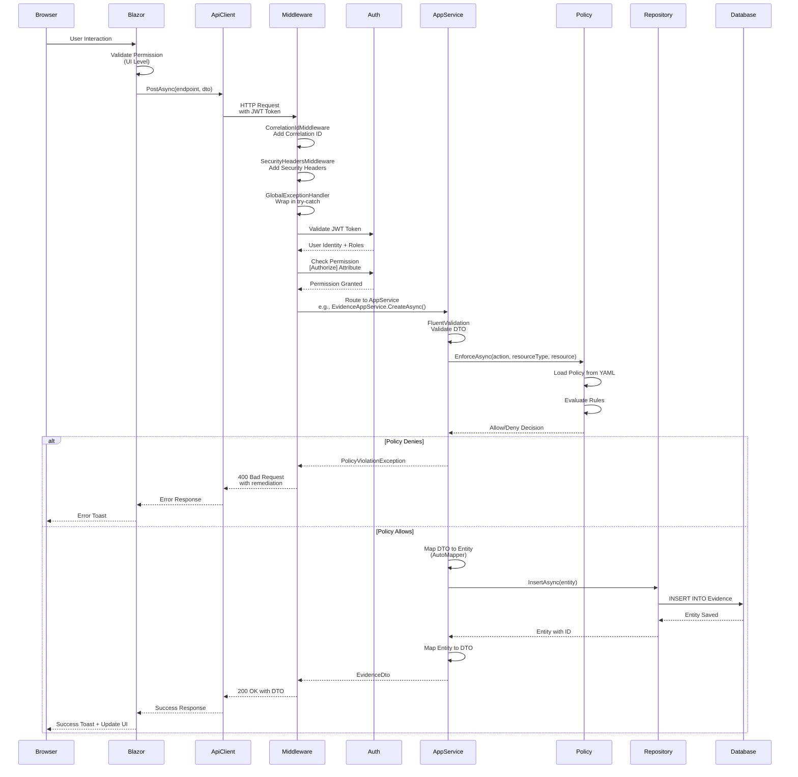

# Request Processing Flow (End-to-End)

## Description
Complete request lifecycle from browser interaction through all middleware layers, authentication, authorization, business logic, and database persistence. Shows the full request/response cycle.

## Diagram

## Request Pipeline Stages

### Stage 1: Client Side (Blazor)
1. User interaction triggers action
2. UI-level permission check (optional, for UX)
3. ApiClientService prepares HTTP request with JWT token

### Stage 2: Middleware Pipeline
1. **CorrelationIdMiddleware**: Adds unique correlation ID for request tracking
2. **SecurityHeadersMiddleware**: Adds security headers (X-Frame-Options, CSP, etc.)
3. **GlobalExceptionHandler**: Wraps request in try-catch for error handling
4. **CORS**: Handles cross-origin requests
5. **Authentication**: Validates JWT token
6. **Multi-Tenancy**: Resolves tenant context
7. **Authorization**: Checks permissions

### Stage 3: Application Service
1. **FluentValidation**: Validates DTO input
2. **Policy Enforcement**: Evaluates business rules
3. **AutoMapper**: Maps DTO to Entity
4. **Business Logic**: Applies domain rules

### Stage 4: Data Access
1. **Repository Pattern**: Abstracts data access
2. **Entity Framework Core**: Generates SQL
3. **Database**: Executes SQL and returns result

### Stage 5: Response
1. **AutoMapper**: Maps Entity to DTO
2. **Middleware**: Adds headers, handles errors
3. **Client**: Receives response and updates UI

## Error Handling

### Policy Violation
- **Exception**: `PolicyViolationException`
- **HTTP Status**: 400 Bad Request
- **Response**: Includes remediation hint and rule ID
- **User Experience**: Error toast with actionable message

### Permission Denied
- **Exception**: `AbpAuthorizationException`
- **HTTP Status**: 403 Forbidden
- **Response**: Standard ABP error response
- **User Experience**: Error toast

### Validation Error
- **Exception**: `AbpValidationException`
- **HTTP Status**: 400 Bad Request
- **Response**: Validation errors list
- **User Experience**: Field-level error messages

## Related Files
- `src/Grc.Blazor/Services/ApiClientService.cs`
- `src/Grc.HttpApi.Host/Middleware/CorrelationIdMiddleware.cs`
- `src/Grc.HttpApi.Host/Middleware/SecurityHeadersMiddleware.cs`
- `src/Grc.HttpApi.Host/Middleware/GlobalExceptionHandlerMiddleware.cs`
- `src/Grc.HttpApi.Host/GrcHttpApiHostModule.cs`
- `src/Grc.Application/Evidence/EvidenceAppService.cs`
