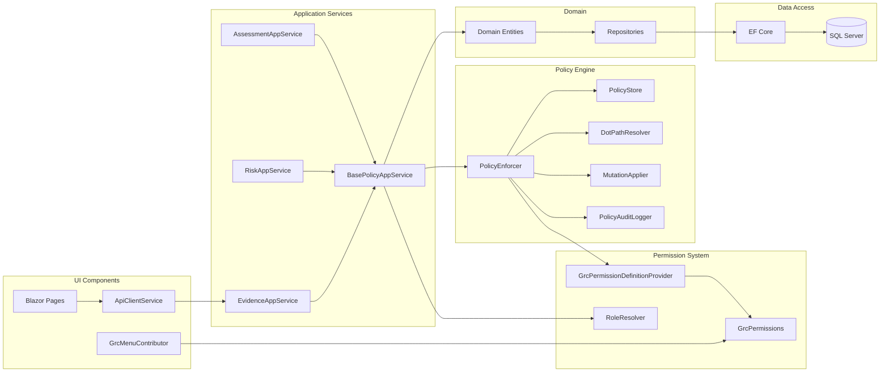

# Component Interaction Diagram

## Description
Shows relationships and dependencies between major system components. Illustrates how different parts of the system interact and depend on each other.

## Diagram

## Component Groups

### UI Components
- **GrcMenuContributor**: Builds Arabic menu based on permissions
- **Blazor Pages**: 56 Razor pages for all GRC modules
- **ApiClientService**: HTTP client wrapper for API communication

### Application Services
- **EvidenceAppService**: Evidence management business logic
- **RiskAppService**: Risk management business logic
- **AssessmentAppService**: Assessment management business logic
- **BasePolicyAppService**: Base class providing policy enforcement

### Policy Engine
- **PolicyEnforcer**: Main policy evaluation engine
- **PolicyStore**: YAML policy loader and cache
- **DotPathResolver**: Resolves dot-path expressions (e.g., `metadata.labels.dataClassification`)
- **MutationApplier**: Applies mutations to resources
- **PolicyAuditLogger**: Logs policy decisions

### Permission System
- **GrcPermissions**: Permission constants (e.g., `Grc.Evidence.View`)
- **GrcPermissionDefinitionProvider**: ABP permission definitions
- **RoleResolver**: Resolves current user roles

### Domain
- **Domain Entities**: 14 core business entities (Evidence, Risk, Assessment, etc.)
- **Repositories**: Data access interfaces

### Data Access
- **EF Core**: Object-relational mapping
- **SQL Server**: Database

## Dependency Flow

1. **UI → Services**: Blazor pages call AppServices via ApiClientService
2. **Services → Policy**: AppServices use BasePolicyAppService which calls PolicyEnforcer
3. **Policy → Store**: PolicyEnforcer loads policies from PolicyStore
4. **Policy → Permissions**: PolicyEnforcer checks permissions via PermProvider
5. **Services → Domain**: AppServices work with Domain Entities
6. **Domain → Data**: Entities accessed via Repositories → EF Core → Database

## Key Patterns

### Dependency Injection
All components registered in ABP modules and injected via constructor

### Repository Pattern
Domain entities accessed through repository interfaces, not directly

### Policy Pattern
Business rules externalized to YAML files, evaluated deterministically

### Base Class Pattern
All AppServices inherit from BasePolicyAppService for consistent policy enforcement

## Related Files
- `src/Grc.Blazor/Menus/GrcMenuContributor.cs`
- `src/Grc.Application/Policy/BasePolicyAppService.cs`
- `src/Grc.Application/Evidence/EvidenceAppService.cs`
- `src/Grc.Application/Policy/PolicyEnforcer.cs`
- `src/Grc.Domain.Shared/Permissions/GrcPermissions.cs`
