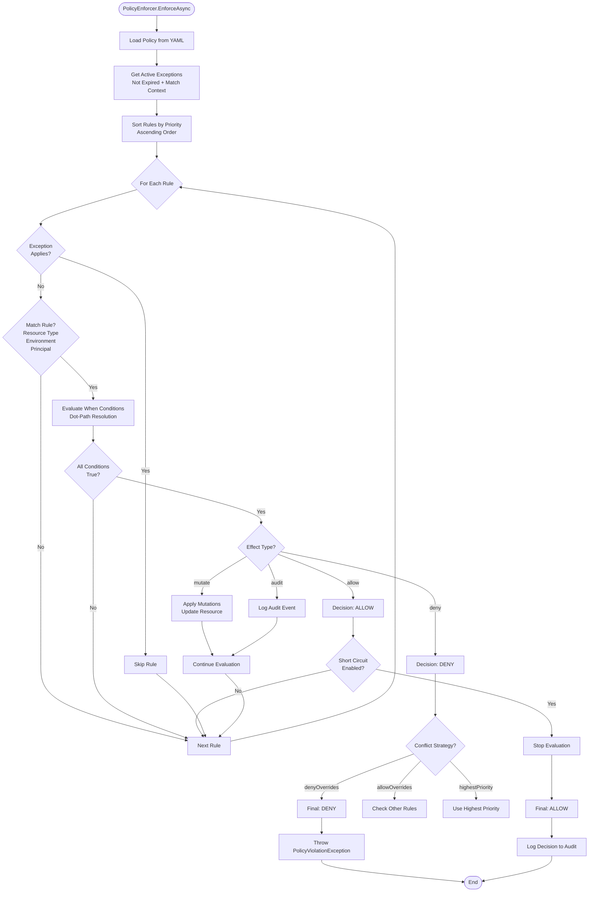

# Policy Rule Evaluation Logic

## Description
Detailed flowchart showing the deterministic policy evaluation algorithm. Shows how rules are evaluated, exceptions are handled, and decisions are made.

## Diagram

## Evaluation Algorithm

### Step 1: Policy Loading
- Load policy from YAML file via PolicyStore
- Cache policy in memory for performance
- Validate policy structure

### Step 2: Exception Processing
- Get all exceptions from policy
- Filter active exceptions (not expired)
- Check if exception matches current context
- Exceptions override matching rules

### Step 3: Rule Sorting
- Sort rules by priority (ascending)
- Lower priority number = evaluated first
- Deterministic order ensures consistent results

### Step 4: Rule Evaluation Loop
For each rule in priority order:

1. **Exception Check**: If exception applies, skip rule
2. **Match Check**: Evaluate match conditions:
   - Resource type match
   - Environment match
   - Principal (user/roles) match
3. **Condition Evaluation**: If match, evaluate "when" conditions:
   - Use DotPathResolver to get values
   - Apply condition operators (equals, exists, matches, etc.)
   - All conditions must be true
4. **Effect Application**: If all conditions true:
   - **deny**: Stop evaluation, throw exception
   - **allow**: Continue evaluation
   - **mutate**: Apply mutations, continue evaluation
   - **audit**: Log event, continue evaluation

### Step 5: Conflict Resolution
If multiple rules match with different effects:
- **denyOverrides**: Any deny wins (default)
- **allowOverrides**: Any allow wins
- **highestPriority**: Highest priority rule wins

### Step 6: Short Circuit
If shortCircuit enabled and terminal decision reached:
- Stop evaluation early
- Return decision immediately

### Step 7: Final Decision
- If any deny: Throw PolicyViolationException
- If all allow: Continue to database operation
- Log decision to audit log

## Deterministic Properties

1. **Same Input = Same Output**: Identical context always produces same decision
2. **Priority Order**: Rules always evaluated in priority order
3. **Exception Priority**: Exceptions evaluated before rules
4. **No Randomness**: No random or time-based decisions

## Related Files
- `src/Grc.Application/Policy/PolicyEnforcer.cs`
- `src/Grc.Application/Policy/PolicyStore.cs`
- `src/Grc.Application/Policy/DotPathResolver.cs`
- `src/Grc.Application/Policy/MutationApplier.cs`
- `etc/policies/grc-baseline.yml`
