# Data Flow: Evidence Creation Example

## Description
Step-by-step data flow for creating evidence, showing validation, transformation, persistence, and output stages. Demonstrates the complete data transformation pipeline.

## Diagram

```mermaid
flowchart LR
    subgraph input["Input"]
        UserInput[User Fills Form<br/>CreateEvidenceDto]
    end
    
    subgraph validation["Validation"]
        FluentVal[FluentValidation<br/>Validate DTO]
        PolicyVal[Policy Enforcement<br/>Check Rules]
    end
    
    subgraph transformation["Transformation"]
        AutoMap[AutoMapper<br/>DTO → Entity]
        Mutation[Apply Mutations<br/>if needed]
    end
    
    subgraph persistence["Persistence"]
        Repo[Repository<br/>InsertAsync]
        EF[EF Core<br/>SaveChanges]
        DB[(Database)]
    end
    
    subgraph output["Output"]
        EntityMap[AutoMapper<br/>Entity → DTO]
        Response[Return EvidenceDto]
    end
    
    UserInput --> FluentVal
    FluentVal --> PolicyVal
    PolicyVal --> AutoMap
    AutoMap --> Mutation
    Mutation --> Repo
    Repo --> EF
    EF --> DB
    DB --> EntityMap
    EntityMap --> Response
```



## Detailed Flow

### Stage 1: Input
**Component**: Blazor Razor Page
- User fills form with evidence details
- Form data bound to `CreateEvidenceDto`
- DTO contains:
  - Name
  - Description
  - Owner (optional, defaults to current user)
  - DataClassification (optional, defaults to "internal")

### Stage 2: Validation

#### FluentValidation
**Component**: `CreateEvidenceDtoValidator`
- Validates required fields
- Validates field formats
- Validates business rules (e.g., name length)
- Returns validation errors if invalid

#### Policy Enforcement
**Component**: `PolicyEnforcer`
- Checks data classification requirement
- Checks owner requirement
- Checks prod approval requirement (if restricted in prod)
- Applies mutations if needed (e.g., normalize empty owner)

### Stage 3: Transformation

#### AutoMapper: DTO → Entity
**Component**: AutoMapper Profile
- Maps `CreateEvidenceDto` to `Evidence` entity
- Sets entity properties:
  - Id (generated)
  - Name
  - Description
  - Owner
  - DataClassification
  - Status (defaults to "Draft")
  - CreationTime (auto-set by ABP)

#### Mutation Application
**Component**: `MutationApplier`
- If policy rule has mutations:
  - Normalize empty owner values
  - Set default values
  - Apply any transformations

### Stage 4: Persistence

#### Repository
**Component**: `IRepository<Evidence, Guid>`
- ABP repository pattern
- `InsertAsync(entity)` called
- Returns inserted entity with generated ID

#### Entity Framework Core
**Component**: `GrcDbContext`
- Generates SQL INSERT statement
- Executes against SQL Server
- Returns saved entity

#### Database
**Component**: SQL Server
- Stores entity in `Evidence` table
- Sets audit fields (CreationTime, CreatorId)
- Returns inserted row

### Stage 5: Output

#### AutoMapper: Entity → DTO
**Component**: AutoMapper Profile
- Maps `Evidence` entity to `EvidenceDto`
- Includes all entity properties
- Adds computed properties if any

#### Response
**Component**: HTTP Response
- Returns `EvidenceDto` as JSON
- HTTP Status: 200 OK
- Includes correlation ID in headers

## Example Data Transformation

### Input (CreateEvidenceDto)
```json
{
  "name": "Security Audit Report",
  "description": "Q4 2025 security audit",
  "owner": null,
  "dataClassification": "confidential"
}
```

### After FluentValidation
- Validates name is not empty
- Validates description length
- All validations pass

### After Policy Enforcement
- Data classification: ✓ (confidential is valid)
- Owner: Set to current user (mutation applied)
- Final entity ready

### After AutoMapper (Entity)
```csharp
{
  Id: Guid.NewGuid(),
  Name: "Security Audit Report",
  Description: "Q4 2025 security audit",
  Owner: "current-user@example.com", // Set by mutation
  DataClassification: "confidential",
  Status: "Draft",
  CreationTime: DateTime.UtcNow
}
```

### After Database (Entity with ID)
```csharp
{
  Id: "123e4567-e89b-12d3-a456-426614174000",
  // ... same as above
}
```

### Output (EvidenceDto)
```json
{
  "id": "123e4567-e89b-12d3-a456-426614174000",
  "name": "Security Audit Report",
  "description": "Q4 2025 security audit",
  "owner": "current-user@example.com",
  "dataClassification": "confidential",
  "status": "Draft",
  "creationTime": "2026-01-02T10:30:00Z"
}
```

## Related Files
- `src/Grc.Application.Contracts/Evidence/CreateEvidenceDto.cs`
- `src/Grc.Application.Contracts/Evidence/EvidenceDto.cs`
- `src/Grc.Application/Evidence/EvidenceAppService.cs`
- `src/Grc.Domain/Evidence/Evidence.cs`
- `src/Grc.Application/GrcApplicationAutoMapperProfile.cs`
- `src/Grc.Application/Validators/Evidence/CreateEvidenceDtoValidator.cs`
